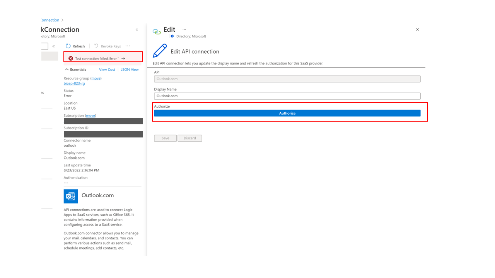

# Solution Accelerator Configurations
Please follow the steps below to set up the solution accelerator. 

## Step 1: Replace Model ID in Azure Functions App Settings

1. From the the [Azure Portal](https://portal.azure.com), locate your subscription and resource group you used to deploy the solution in the previous steps.
2. Find the Azure Functions App, click the resource and get to its overview page. 
3. On left panel, under section `Settings`, click `Configuration`.  Under the **Application settings**, locate `CUSTOM_BUILT_MODEL_ID`, click it and edit the value. Replace with the model id you created from Azure Document Intelligence when you trained the model. If you followed the instructions in the [Machine Learning Model Guide](../2_machine_learning_model/README.md), your model id was set as `contoso-safety-forms`. 
4. click `OK` and then `Save`. After this, your azure functions app will work with this model.

## Step 2: Set Up Outlook Logic App (Optional)

Please note: If you do not have forms sent to an outlook email for processing, you can skip this step. 

If you do use this feature, that means you have set up a designated and dedicated outlook email account that receives PDF forms as attachments. The PDF forms will be the same formats as the ones you have used to create the machine learning model. Other unexpected PDF attachments will corrupt the system or cause exceptions. It will be a good practice to limit the senders to only trusted parties and prevent malicious actors from spamming outlook email account.

The sole feature of this logic app is to extract attached pdf forms and then upload them to Azure Data Lake Storage container '`files-1-input`'. The form processing logic app will pick up the uploaded forms for further processing. 

1. From the the [Azure Portal](https://portal.azure.com), locate your subscription and resource group you used to deploy the solution in the previous steps.

2. Find the API to outlook. Its name is suffixed with **ApiToOutlook**. 

3. Click `Test Connection failed. Error ->` and then click **Authorize** with valid outlook email address and authentication information, as illustrated below.  This is the designated outlook email id used to receive pdf forms as attachments. This will authorize the email logic app to have the permission to read emails received from this outlook account.

   

4. From the [Azure Portal](https://portal.azure.com), locate the outlook logic app In the menu pane on the left, under the `Development Tools` section, click `Logic app designer`, click `Save` to save the logic app. Now the logic app will be using the authorized outlook connection.

5. Click `Run Trigger` to activate the logic app.

