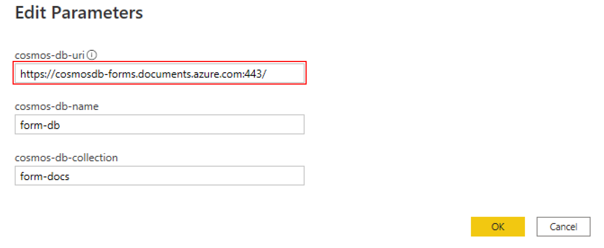
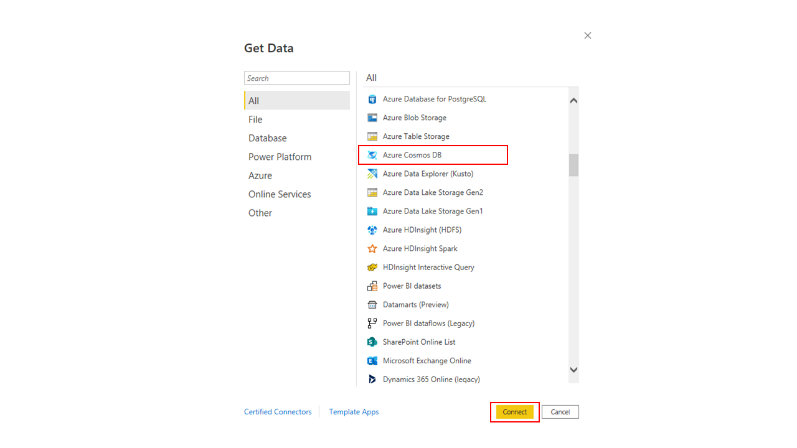
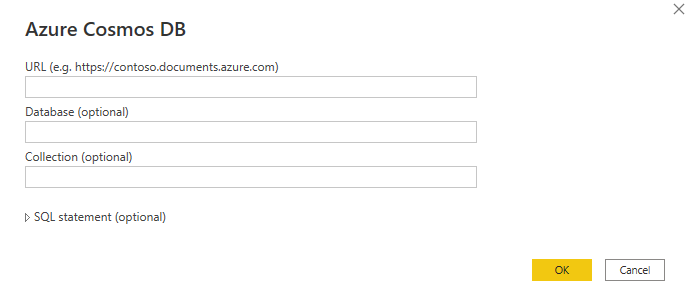
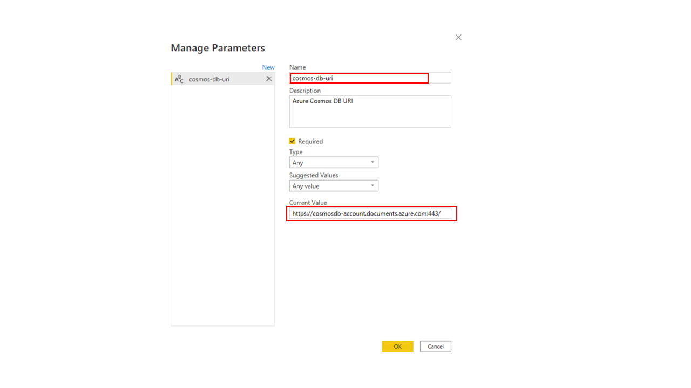

# Set up Power BI Model
## 1. Set up Power BI Model 

Please follow the steps below to test the power BI model that is supplied with this solution accelerator. 

1. In the Azure Portal, locate your Azure Cosmos DB. From left panel, under `Settings`, click `Keys`, you will see the URI of your Cosmos DB, and account keys. Copy these for later use. 

2. Open the [Power BI report](./Safety-Form-Report.pbix) in this directory

3. From the `Transform data` drop down menu, click `Edit Parameters`, as illustrated below: 

   

4. Fill in the Cosmos DB URI you saved previously, as illustrated below, and click Ok.

   

5. Power BI will prompt you to apply change, as illustrated below. Click `Apply changes`. 

   

6. Power BI will prompt you to enter Cosmos DB Account Key, as illustrated below. Enter your Cosmos DB Account key you saved previously and then click `Connect`. After this, you should see a similar dashboard shown in the [solution accelerator overview](../../README.md).

   

## 2. Develop New Power BI Model (Optional)

Optionally, you can develop your own power BI model. Below steps may be helpful if you are new to Power BI model development and wonder how the parameters were set in section 1, "Set up Power BI Model".

1. Open Power BI desktop. From the top tool bar, click `Get data` drop down menu, locate and then click `Azure Cosmos DB`, as illustrated below. Click `Connect`. 

   

2. Connect to your Azure Cosmos DB by filling in the information below, then click OK.  For the Database field, fill in `form-db`, and for the Collection field, fill in `form-docs`. 

   

3. Click `Transform Data`.  A new dialog window is open as illustrated below. On top tool bar, Click `Manage Parameters` and then click `New Parameter`. 

   

4. Define your first parameter `cosmos-db-uri`, as illustrated below.  For `Type`, choose `text`. For `Suggested value`, choose `Any value`. Then define two more parameters `cosmos-db-name` and `cosmos-db-collection`. Please note the `Current Value` needs to match name set up in Azure Cosmos DB. 

5. Transform data as desired and create your own Power BI model. Then you can use instructions set up in Step 1 to connect to different Azure Cosmos DBs, for example, your development instance, test instance, or production instance. 
