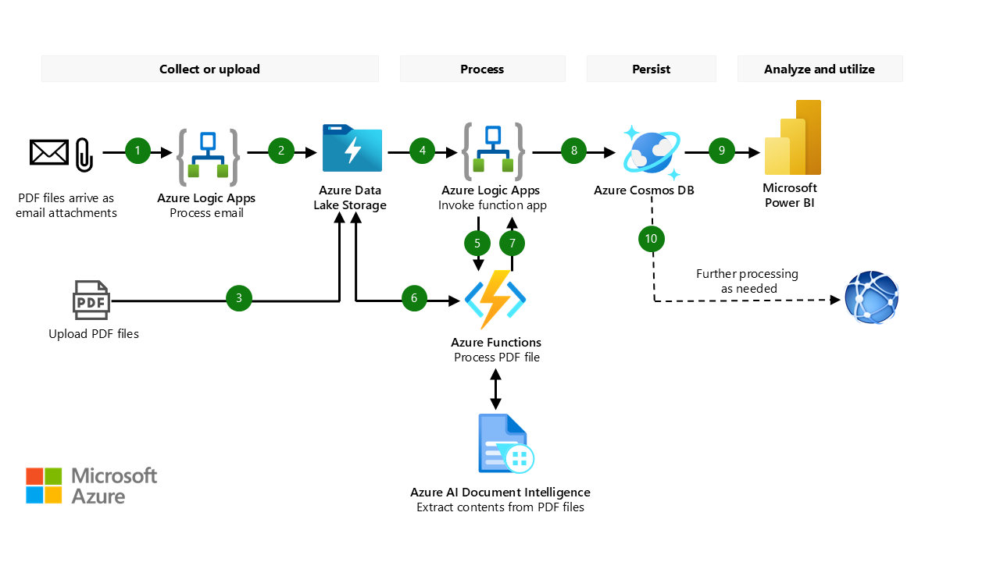

# Architecture Description  
Below architecture diagram illustrates the main components and information flow of this solution accelerator. 

## 

## Workflow 

The workflow corresponding to the above architecture is described as below: 

1. A designated Outlook email account receives PDF files as attachments. The arrival of an email triggers a logic app to process the email. The logic app is built by using the capabilities of Azure Logic Apps.
1. The logic app uploads the PDF files to a container in Azure Data Lake Storage.
1. You can also manually or programmatically upload PDF files to the same PDF container.
1. The arrival of a PDF file in the PDF container triggers another logic app to process the PDF forms that are in the PDF file.
1. The logic app sends the location of the PDF file to a function app for processing. The function app is built by using the capabilities of Azure Functions.
1. The function app receives the location of the file and takes these actions:
   1. It splits the file into single pages if the file has multiple pages. Each page contains one independent form. Split files are saved to a second container in Data Lake Storage.
   1. It uses HTTPS POST, an Azure REST API, to send the location of the single-page PDF file to AI Document Intelligence for processing. When Azure AI Document Intelligence completes its processing, it sends a response back to the function app, which places the information into a data structure.
   1. It creates a JSON data file that contains the response data and stores the file to a third container in Data Lake Storage.
1. The forms processing logic app receives the processed response data.
1. The forms processing logic app sends the processed data to Azure Cosmos DB, which saves the data in a database and in collections.
1. Power BI obtains the data from Azure Cosmos DB and provides insights and dashboards.
1. You can implement further processing as needed on the data that's in Azure Cosmos DB.
